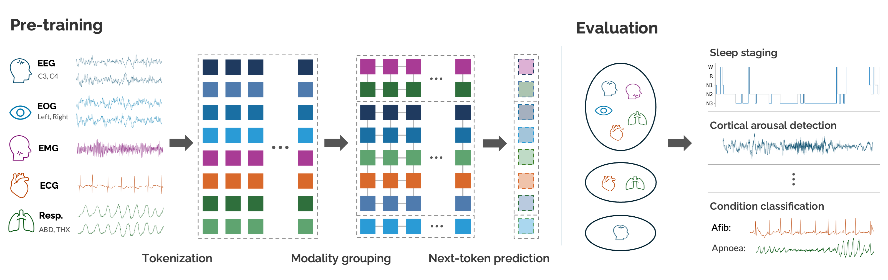
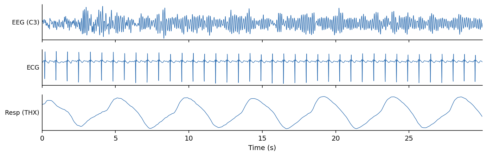

<h1 align="center">Hypnos</h1>

<p align="center">
  <em>Next-Token Prediction Learns Generalisable Representations of Sleep Physiology</em>
</p>

<p align="center">
  <a href="https://arxiv.org/abs/2606.09605"></a>
  <a href="https://huggingface.co/joncarter/hypnos"></a>
  <a href="https://pypi.org/project/hypnos/"></a>
</p>

<p align="center">
  
</p>

## Updates

**June 2026**
- **Initial release**: the pretrained Hypnos model is available on the [HuggingFace Hub](https://huggingface.co/joncarter/hypnos), together with a minimal inference library for generating sleep embeddings from EDF recordings. Paper: [arXiv:2606.09605](https://arxiv.org/abs/2606.09605).

## Installation

```bash
pip install hypnos          # or: uv add hypnos
```

To work on the library itself, clone the repo and install from source:

```bash
uv sync                     # or: pip install -e .
```


## Usage

Load an EDF, preprocess, and generate embeddings from the pre-trained Hypnos model:

```python
from hypnos.embedding import embed_edf

emb = embed_edf("recording.edf")
# emb: dict {modality_name: np.ndarray [n_seconds, embed_dim] float16}
#   e.g. emb["eeg_c3"], emb["ecg"], ... — one vector per second, per present modality
```

Embeddings are returned **per modality** (`z^i_t`) at the model's native **1 Hz** resolution
(one vector per second). Only modalities present in the recording appear in the dict. The
model defaults to the released weights on the Hub (`joncarter/hypnos`); pass a repo id or
local path to override.

The pipeline runs: **EDF → preprocess (resample / causal filter / normalize) → per-modality
tokenization → RQ-Transformer → 1 Hz per-modality embeddings**. For US recordings
pass `notch_freq=60.0` (the default is 50 Hz) to match the powerline frequency.


Reuse a loaded model across recordings with the step-by-step API:

```python
from hypnos.embedding import load_model, preprocess_edf, tokenize, embed

model, tokenizers, meta = load_model(device="cpu")
signals = preprocess_edf("recording.edf", meta)
tokens, modality_mask, channel_ids = tokenize(tokenizers, meta, signals)
emb = embed(model, tokens, modality_mask, channel_ids, meta)   # {name: [T, D]}
```

### Pooling

Hypnos produces embeddings at 1 Hz for each modality. In our experiments, we found that simple pooling over modalities and timescales works well for downstream tasks. For example, to produce a single embedding per 30-second sleep epoch:

```python
import numpy as np

emb = embed_edf("recording.edf")

# Average over modalities -> [n_seconds, embed_dim]  (the summary vector z_t)
fused = np.mean(list(emb.values()), axis=0)

# Mean-pool over each 30-second epoch -> [n_epochs, embed_dim]
n_epochs = fused.shape[0] // 30
epochs = fused[: n_epochs * 30].reshape(n_epochs, 30, -1).mean(axis=1)
```

### Generation

Hypnos is fully generative, and can be used to auto-regressively forecast physiological signals conditioned on input context:

```python
from hypnos.embedding import load_model, synthesize

model, tokenizers, meta = load_model()
print([m.name for m in meta.modalities])   # available modality names

# Jointly generate three modalities from a cold start (no recording needed).
signals = synthesize(model, tokenizers, meta,
                     modalities=["eeg_c3", "ecg", "resp_thx"], num_steps=30)
# signals: {name: 1-D waveform at the modality's native rate}
#   signals["ecg"] → 30 s @ 128 Hz = (3840,);  signals["resp_thx"] → (960,)
```

Pass `prompt_tokens` (e.g. from `tokenize(...)`) to forecast a continuation of a real
recording.
<p align="center">
  
  <br>
  <em>EEG, ECG and respiration jointly generated by Hypnos from a cold start (30 s).</em>
</p>

## Pretrained checkpoints

The whole model — the RQ-Transformer **and** all 5 tokenizers — ships as a **single
`safetensors` file**, `hypnos.safetensors`. All weights live under namespaced keys
(`model/…`, `tok/<name>/…`) and the config (model + tokenizer construction kwargs, modality
layout) is a JSON string in the file's metadata, so loading is fully self-contained and needs
no config framework. safetensors is a pure-tensor format — no arbitrary-code unpickling.

`load_model` / `embed_edf` default to the released weights on the Hub, and also accept:

- a HuggingFace repo id, e.g. `"owner/hypnos"` (downloads the bundle file),
- a local path to the `.safetensors` bundle,
- a local directory containing `hypnos.safetensors`.


> **Devices:** CUDA, CPU, and Apple Silicon (MPS) are all supported. On CUDA, windowed
> attention uses a fused `flex_attention` kernel. `flex_attention` has no Metal kernel, so on
> MPS — and in eager mode on CPU — the model falls back to a dense-mask SDPA path that
> materialises a full `(chunk, chunk)` score matrix per head: peak memory grows ~quadratically
> with `chunk_tokens` (≈8 GB at the default of 2048; ≈19 GB at 4096). Recording length itself
> does **not** raise peak memory — chunks run sequentially — so a full night works on CPU or
> MPS (a 3 h record takes ~50 s at ~11 GB RAM on CPU). On Apple Silicon this memory is shared
> with the system, so lower `chunk_tokens` if constrained.